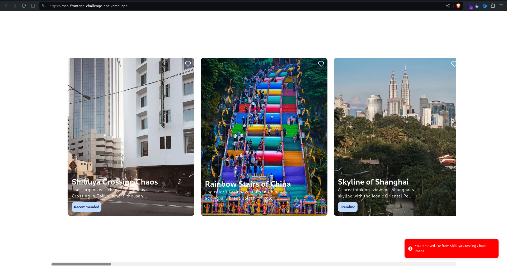

<h1 align="center">MAP_Frontend_Challenge-01</h1>

<p align="center">This is a Minimist site build with React.js and Tailwind Css to showcase the images horizontally.</p>

## Prerequisites

Node.Js or Bun installed on your local machine.

## Local Setup

`NOTE: Commands are to be executed on Linux, Mac, and Windows(using Powershell)`

1. Clone this repo using:

```sh
git clone https://github.com/Prathamdas3/MAP_Frontend_Challenge-01.git
```

2. To install dependencies and clean the git repo run:

```sh
npm install
or
pnpm install
or
bun install
```

3. Run the development server:

```sh
npm run dev
or
pnpm run dev
or
bun run dev
```

4. Open [http://localhost:3000](http://localhost:3000) with your browser to see the result.

## Libraries

1. **React.js:** React js used here to make the client side rendering part.
2. **Tailwind CSS:** Tailwind CSS is used here to give this site a design.
3. **Lucid-React:** Lucid-react is used in this project for importing different icons
4. **Sonner:** Sonner is used to send notification alert according to the user's action

## Screenshots

Horizontal images for the scroll


Add likes to the Images


Like stays after reload


Remove the like from the image



## Links

[Youtube Link](https://youtu.be/R1aQl61XQNw)

[Github Link](https://github.com/Prathamdas3/MAP_Frontend_Challenge-01.git)

[Live Link](https://map-frontend-challenge-01-one.vercel.app)
